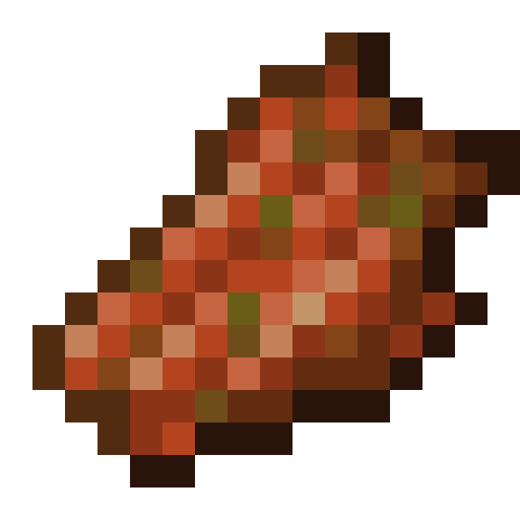
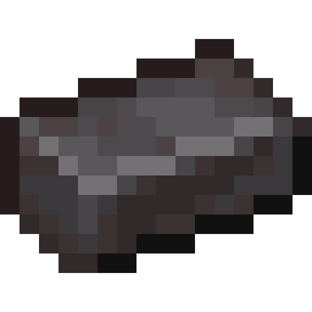

# Making a crafting altar
One dropper in the center, and materials all around. Based on the materials, the crafting altar will have a different power level
##  Omniscient clock
Requires at least a **basic crafter**.
### Usage
The omniscient clock will show how much time will pass until you receive a new bonus.
### Crafting
  
  

##  Totem of time I
Requires a **basic crafter**.
### Usage
If you right click while you have this totem in your main hand, you will remove 8 minutes from the bonus timer.
### Crafting
  
  

##  Soul fragment
Requires at least a **basic crafter+**.
### Usage
The soul fragment is super useful in other recipes.
### Crafting
  
  

## Villager spawn egg
Requires at least a **normal crafter**.
### Usage
Pretty good for trades and farms, I guess.
### Crafting
  
  

